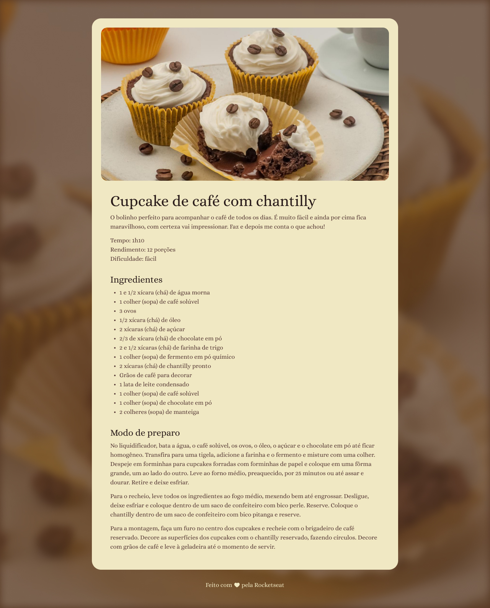

# Recipe Page

A simple recipe page using HTML and CSS.

     <a href="https://pagina-de-receita-kts.netlify.app/">📱 Visit this Project</a> 
     <a href="https://www.figma.com/design/fbZbCAr1yw41PYoWF4j3O9/P%C3%A1gina-de-receita-(Community)?node-id=3-811&t=SyVn03iydnbBk7sv-0">🎨 Figma</a>

    

## Tech Stack

